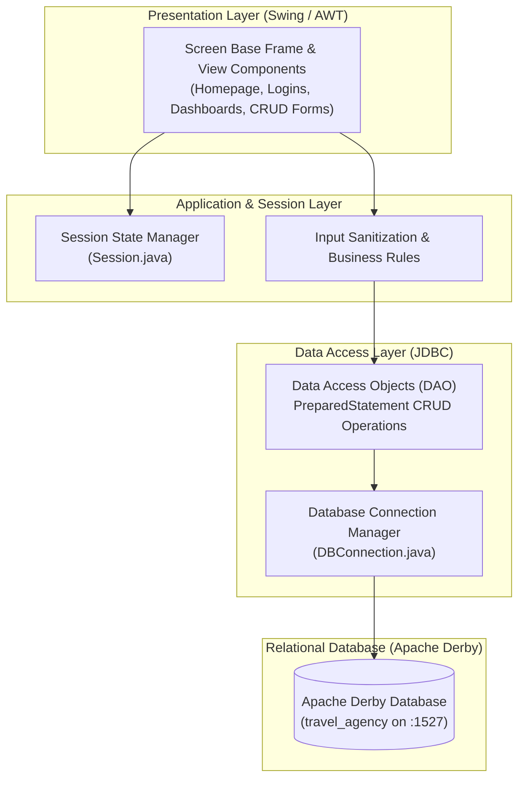
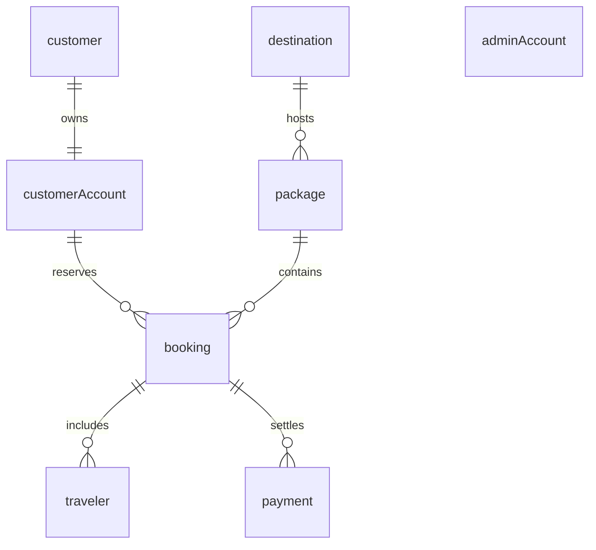

<div align="center">

# ✈️ Travel Agency Management System (TAMS)
### *A Robust, Offline Enterprise Desktop Solution for Travel & Tourism Management*

[](https://www.oracle.com/java/)
[](https://docs.oracle.com/javase/tutorial/uiswing/)
[](https://db.apache.org/derby/)
[](https://maven.apache.org/)
[](#academic-credits)

<p align="center">
  <b>Technological University of the Philippines – Taguig City</b><br>
  College of Science and Technology • Bachelor of Science in Information Technology (BSIT-T-2B-T)<br>
  <i>Course: Computer Programming 4</i>
</p>

---

</div>

## 📖 Table of Contents
1. [Executive Summary](#-executive-summary)
2. [Key Capabilities & Modules](#-key-capabilities--modules)
3. [System Architecture](#-system-architecture)
4. [Database Design & Schema](#-database-design--schema)
5. [Security & Design Patterns](#-security--design-patterns)
6. [Prerequisites & Environment Setup](#-prerequisites--environment-setup)
7. [Installation & Deployment](#-installation--deployment)
8. [Seed Data & Test Accounts](#-seed-data--test-accounts)
9. [Project Directory Structure](#-project-directory-structure)
10. [Academic Credits](#-academic-credits)

---

## 📋 Executive Summary

The **Travel Agency Management System (TAMS)** is an enterprise-grade desktop information system developed to centralize and automate the day-to-day operational workflow of modern travel and tour agencies. 

Manual booking pipelines typically suffer from duplicated records, disjointed paper trails, error-prone expense tracking, and slow report generation. TAMS resolves these issues by delivering a normalized, self-contained desktop platform powered by **Apache Derby** and an intuitive **Java Swing** graphical interface. It enforces data integrity, role-based access control, cryptographic credential security, and end-to-end booking life cycles without reliance on continuous internet connectivity.

---

## 🚀 Key Capabilities & Modules

### 👤 Customer Experience
* **Self-Service Registration & Authentication**: User validation, encrypted password storage, and duplicate username/email prevention.
* **Destination & Package Discovery**: Explore available holiday tours, itineraries, participant caps, and pricing.
* **Reservation Lifecycle**: Multi-traveler registration per booking, cost calculation, and departure scheduling.
* **Payment Recording**: Support for diverse transaction methods (Cash, GCash, Credit/Debit Card, Bank Transfer).
* **Booking Ledger**: Personal reservation history with status tracking (`Pending`, `Confirmed`, `Cancelled`, `Completed`).

### 🛡️ Administrative Portal
* **Destination Management**: Add, update, catalog, or archive regional and international travel destinations.
* **Package Customization**: Configure travel packages, link destination foreign keys, enforce capacity bounds (`minTraveller` to `maxTraveller`), and set prices.
* **Reservation & Passenger Oversight**: Real-time inspection of customer bookings, approval transitions, and traveler rosters.
* **Customer Account Governance**: Monitor registered traveler profiles and account access status.
* **Financial & Revenue Auditing**: Aggregate transaction logs, payment verification, and automated sales reporting.
* **System Administration**: Role-based administrative management (`Admin`, `Manager`).

---

## 🏗️ System Architecture

TAMS follows a strict multi-tier software architecture ensuring clean separation of presentation, business logic, data persistence, and relational storage:



---

## 🗄️ Database Design & Schema

The relational schema is fully normalized (**3NF**) and maintains strict referential constraints across 8 database entities:

| Table | Primary Key | Foreign Keys | Key Responsibilities |
| :--- | :--- | :--- | :--- |
| `customer` | `customerID` | — | Customer demographics, personal details, unique email constraint. |
| `customerAccount` | `customerAccountID` | `customerID` | Authentication credentials, account activity status (`Active`, `Suspended`). |
| `destination` | `destinationID` | — | Travel locations, regions, and promotional descriptions. |
| `package` | `packageID` | `destinationID` | Tour packages, participant thresholds, pricing per traveler. |
| `booking` | `bookingID` | `customerAccountID`, `packageID` | Master reservation header, departure dates, and booking status. |
| `traveler` | `travelerID` | `bookingID` | Individual manifest of passengers traveling under a reservation. |
| `payment` | `paymentID` | `bookingID` | Financial transactions, payment mode, and verified receipts. |
| `adminAccount` | `adminAccountID` | — | Administrative users and authorization roles. |



---

## 🔐 Security & Design Patterns

* **Cryptographic Hashing**: User and administrator passwords are encrypted using **SHA-256** digests before persistence; plain text passwords are never stored in the database.
* **SQL Injection Prevention**: All SQL transactions strictly employ parameterized JDBC `PreparedStatement` interfaces.
* **Centralized Session Pattern**: [`Session.java`](src/main/java/common/Session.java) acts as a static session repository, holding user authorization contexts to avoid telescoping constructors across navigational transitions.
* **Template & Component Reuse**: [`Screen.java`](src/main/java/common/Screen.java) encapsulates foundational window configurations, standardized typographies, input factories, and lifecycle methods.
* **Data Access Object (DAO) Pattern**: Decouples Swing UI frames from relational SQL statements, maintaining testability and clean code governance.

---

## 💻 Prerequisites & Environment Setup

Ensure the following tools are installed on your host system:
* **Java Development Kit (JDK)**: Version 21 LTS or later.
* **Apache NetBeans IDE**: Version 17, 18, 19, or higher (with Maven support enabled).
* **Apache Derby RDBMS**: Java DB included with or configured in NetBeans.

---

## 📦 Installation & Deployment

### 1. Clone the Repository
```bash
git clone https://github.com/abenadigor/Travel-Agency-Management-System.git
cd Travel-Agency-Management-System
```

### 2. Configure the Apache Derby Database
1. Launch **Apache NetBeans**.
2. Navigate to the **Services** tab in the left sidebar.
3. Expand **Databases** $\rightarrow$ Right-click **Java DB** $\rightarrow$ Select **Start Server**.
4. Right-click **Java DB** $\rightarrow$ Select **Create Database...**:
   * **Database Name**: `travel_agency`
   * **User Name**: `root`
   * **Password**: `password`
5. Connect to the newly created database connection:
   ```text
   jdbc:derby://localhost:1527/travel_agency;create=true
   ```

### 3. Initialize Schema & Tables
Open and execute the DDL script in NetBeans SQL Editor:
```text
src/main/java/Database-Script-Apache-Derby.sql
```

### 4. Seed Initial Data
Execute the database seeder to establish baseline administrators and sample customer accounts:
* Locate [`src/main/java/common/DatabaseSeeder.java`](src/main/java/common/DatabaseSeeder.java).
* Right-click the file $\rightarrow$ Select **Run File** (or press <kbd>Shift</kbd> + <kbd>F6</kbd>).

### 5. Launch the System
* Set [`src/main/java/main/Main.java`](src/main/java/main/Main.java) as the main class or press <kbd>F6</kbd> (Run Project).

---

## 🔑 Seed Data & Test Accounts

The following credentials are automatically configured for testing:

### Administrative Accounts
| Username | Password | Role | Access Level |
| :--- | :--- | :--- | :--- |
| `admin` | `admin123` | **Admin** | Full system governance, configuration, and auditing |
| `manager` | `manager123` | **Manager** | Operational management and reporting |

### Customer Accounts
| Username | Password | Customer Name | Email |
| :--- | :--- | :--- | :--- |
| `juan` | `juan123` | Juan Dela Cruz | `juan@example.com` |
| `maria` | `maria123` | Maria Clara | `maria@example.com` |

---

## 📂 Project Directory Structure

```text
Travel-Agency-Management-System/
├── information/                        # Project specifications & academic documentation
├── src/
│   ├── main/
│   │   ├── java/
│   │   │   ├── common/                 # Core framework & persistent utilities
│   │   │   │   ├── DBConnection.java   # Centralized JDBC connection factory
│   │   │   │   ├── DatabaseSeeder.java # Initial system state seeder
│   │   │   │   ├── Screen.java         # Base JFrame template & UI helper components
│   │   │   │   └── Session.java        # Global user authorization & session state
│   │   │   ├── dao/                    # Database Access Object layer
│   │   │   │   ├── AdminAccountDAO.java
│   │   │   │   ├── CustomerAccountDAO.java
│   │   │   │   └── CustomerDAO.java
│   │   │   ├── model/                  # Data entity models (POJOs)
│   │   │   │   ├── AdminAccount.java
│   │   │   │   ├── Booking.java
│   │   │   │   ├── customer.java
│   │   │   │   ├── CustomerAccount.java
│   │   │   │   ├── Destination.java
│   │   │   │   ├── Payment.java
│   │   │   │   ├── Traveler.java
│   │   │   │   └── TravelPackage.java
│   │   │   ├── ui/                     # UI Presentation components
│   │   │   │   ├── admin/              # Administrative modules & management screens
│   │   │   │   ├── customer/           # Customer portal & booking screens
│   │   │   │   ├── AdminLogin.java
│   │   │   │   ├── CustomerLogin.java
│   │   │   │   ├── CustomerRegister.java
│   │   │   │   └── Homepage.java
│   │   │   ├── main/
│   │   │   │   └── Main.java           # Application bootstrap entry point
│   │   │   └── Database-Script-Apache-Derby.sql
│   └── test/                           # Unit and integration test suites
├── pom.xml                             # Project Object Model & Maven dependencies
└── README.md                           # Project technical documentation
```

---

## 🎓 Academic Credits

Developed under the curriculum of **Technological University of the Philippines – Taguig City**, College of Science and Technology.

* **Course**: Computer Programming 4 (BSIT-T-2B-T)
* **Instructor**: Prof. Maria Cristina D. Baloloy
* **Development Team (Group 8)**:
  * Alexis B. Salinas
  * Abenadi E. Corregidor
  * John Rey D. Luzada
  * Rene Clert N. Baterbonia
  * *Collaborators & Group Members*

---

<div align="center">
  <sub>Built with Java & Apache Derby • Maintained by TAMS Development Team</sub>
</div>
